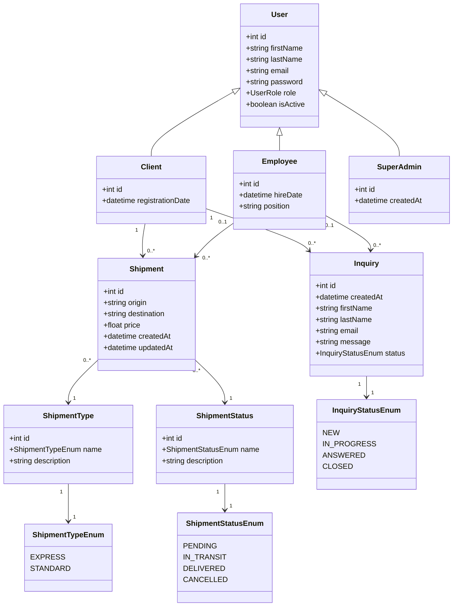

```mermaid
classDiagram

%% ======================
%% CLASSES
%% ======================

class User {
  +int id
  +string firstName
  +string lastName
  +string email
  +string password
  +UserRole role
  +boolean isActive
}

class Client {
  +int id
  +datetime registrationDate
}

class Employee {
  +int id
  +datetime hireDate
  +string position
}

class SuperAdmin {
  +int id
  +datetime createdAt
}

class Shipment {
  +int id
  +string origin
  +string destination
  +float price
  +datetime createdAt
  +datetime updatedAt
}

class ShipmentStatus {
  +int id
  +ShipmentStatusEnum name
  +string description
}

class ShipmentType {
  +int id
  +ShipmentTypeEnum name
  +string description
}

class Inquiry {
  +int id
  +datetime createdAt
  +string firstName
  +string lastName
  +string email
  +string message
  +InquiryStatusEnum status
}

%% ======================
%% ENUMS
%% ======================

class ShipmentStatusEnum {
  PENDING
  IN_TRANSIT
  DELIVERED
  CANCELLED
}

class ShipmentTypeEnum {
  EXPRESS
  STANDARD
}

class InquiryStatusEnum {
  NEW
  IN_PROGRESS
  ANSWERED
  CLOSED
}

%% ======================
%% INHERITANCE
%% ======================

User <|-- Client
User <|-- Employee
User <|-- SuperAdmin

%% ======================
%% RELATIONSHIPS
%% ======================

Client "1" --> "0..*" Shipment
Employee "0..1" --> "0..*" Shipment

Shipment "0..*" --> "1" ShipmentType
Shipment "0..*" --> "1" ShipmentStatus

Client "1" --> "0..*" Inquiry
Employee "0..1" --> "0..*" Inquiry

ShipmentStatus "1" --> "1" ShipmentStatusEnum
ShipmentType "1" --> "1" ShipmentTypeEnum
Inquiry "1" --> "1" InquiryStatusEnum
```
